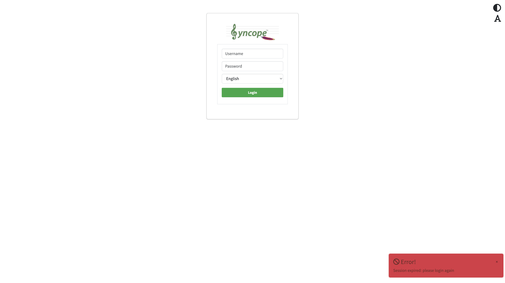

# Build and Deploy

Build artifacts and run Syncope on **Local**, **Docker**, or **Kubernetes**. For runtime components and repository layout, read [Project architecture](../architecture/overview.md) first.

Pick **one** runtime path below. Prepare PostgreSQL (and optional Mailpit) before the first Core startup. Console configuration is the same once Core and Console are running.

| Path   | Typical use                                            | Database (example) | Core / Console / Enduser ports                         |
|:-------|:-------------------------------------------------------|:-------------------|:-------------------------------------------------------|
| Local  | Custom fork, full control of Tomcat                    | `syncope`          | **9080** / **9080** / **9080**                         |
| Docker | Locally built images + **external** PostgreSQL on host | `syncope`          | **18080** / **28080** / **38080**                      |
| K8s    | Helm on cluster + **external** PostgreSQL on host      | `syncope`          | **18080** / **28080** / **38080** (after port-forward) |

### Path conventions

Unless stated otherwise:

- **Repository root** — the directory that contains the top-level `pom.xml`. Run all `mvn`, `docker compose`, and `helm` commands from here.
- **Paths in commands** — relative to the repository root (for example `standalone/target/…`, `docker/src/main/resources/…`).
- **Install directory** — where you extract the standalone ZIP (`SYNCOPE_INSTALL`, your choice). Not part of the git tree.
- **Tomcat home** — the `apache-tomcat-*` directory inside the install directory; use `CATALINA_HOME` in shell examples below.
- **JDK home** — the JDK 25 installation directory (contains `bin/java`); set `JAVA_HOME` before Maven or Tomcat.

---

## Build

Build produces **artifacts** (ZIP, container images). It does not start Syncope or configure the database.

### Shared prerequisites

Keep the project **POM settings unchanged** unless you intentionally fork the JDK baseline. Maven bytecode targets are defined per module; the JVM you use to run `mvn` is the **compiler JDK**.

| Item                                             | Version | Notes                                                                                                        |
|:-------------------------------------------------|:--------|:-------------------------------------------------------------------------------------------------------------|
| Compiler JDK (`JAVA_HOME` for `mvn`)             | **25**  | This guide uses JDK **25** for build and runtime. Upstream CI uses Temurin **21**; either works as compiler. |
| Syncope bytecode (`targetJdk` in root `pom.xml`) | **21**  | `--release 21` for core, client, standalone, docker, fit, ext, …                                             |
| ConnId REST bundle (`ConnIdRESTBundle`)          | **17**  | Independent Tirasa module                                                                                    |
| ConnId Azure bundle (`ConnIdAzureBundle`)        | **8**   | Independent Tirasa module                                                                                    |
| Docker container runtime (Dockerfiles)           | **25**  | `eclipse-temurin:25-jdk-alpine`; enables Virtual Threads in Docker profiles                                  |

Set `JAVA_HOME` before Maven. On JDK 16+, if plugins fail on file I/O, add:

```bash
export MAVEN_OPTS="--add-opens java.base/java.io=ALL-UNNAMED"
```

Run all commands from the **repository root** (see [Path conventions](#path-conventions)).

---

### Local — Standalone distribution

Produces the Tomcat-based ZIP used for local deployment.

| Role          | JDK    | Notes                                                                           |
|:--------------|:-------|:--------------------------------------------------------------------------------|
| Build (`mvn`) | **25** | Set `JAVA_HOME` to JDK **25** (same as Tomcat and Docker runtime).              |
| Build output  | **21** | Syncope modules compile with `--release 21`; ConnId bundles use **17** / **8**. |
| Run (Tomcat)  | **25** | See [Start Tomcat](#start-tomcat) under Deploy.                                 |

```bash
export JAVA_HOME=<JDK 25 installation directory>

mvn -pl standalone -am clean verify \
  -Dcheckstyle.skip=true \
  -DskipTests \
  -Drat.skip=true \
  -Dmaven.build.cache.enabled=false
```

Output:

```text
standalone/target/syncope-standalone-4.1.1-SNAPSHOT-distribution.zip
```

Extract the ZIP to obtain Core, Console, Enduser, and ConnId bundles copied from the FIT build.


---

### Docker — Container images

Build Core, Console, and Enduser images **before** `docker compose up`. Do not rely on pre-pulled `apache/syncope` images from Docker Hub when following this guide.

| Role              | JDK    | Notes                                                                |
|:------------------|:-------|:---------------------------------------------------------------------|
| Build (`mvn`)     | **25** | Same as local build; set `JAVA_HOME` to JDK **25**.                  |
| JARs in the image | **21** | Syncope bytecode from `--release 21`; ConnId bundles **17** / **8**. |
| Container runtime | **25** | Dockerfiles use `eclipse-temurin:25-jdk-alpine`.                     |

```bash
export JAVA_HOME=<JDK 25 installation directory>

mvn clean package -P skipTests,docker \
  -pl docker/core,docker/console,docker/enduser -am \
  -Dcheckstyle.skip=true \
  -Drat.skip=true \
  -Dmaven.build.cache.enabled=false
```

The Fabric8 `docker-maven-plugin` tags local images as:

| Image                    | Tag              |
|:-------------------------|:-----------------|
| `apache/syncope`         | `4.1.1-SNAPSHOT` |
| `apache/syncope-console` | `4.1.1-SNAPSHOT` |
| `apache/syncope-enduser` | `4.1.1-SNAPSHOT` |

Verify:

```bash
docker images 'apache/syncope*'
```

The tag must match `SYNCOPE_VERSION` when you export it before `docker compose up` (default `4.1.1-SNAPSHOT`).

---

### Kubernetes — Images

Kubernetes uses the **same container images** as Docker. Complete [Docker — Container images](#docker--container-images) first.

Helm charts live under:

```text
docker/src/main/resources/kubernetes/syncope/     # Core, Console, Enduser
docker/src/main/resources/kubernetes/postgres/    # optional bundled Postgres (demos)
```

Set `syncopeConfig.tag`, `syncopeConsoleConfig.tag`, and `syncopeEndUserConfig.tag` in your values file to match the built image tag (for example `4.1.1-SNAPSHOT`).

---

## Deploy

Deploy **runs** Syncope on your chosen path. PostgreSQL and Mailpit are **not** started by the build or deploy commands in this guide — prepare them on the host first, then follow one path below.

### PostgreSQL and Mailpit (all paths)

**PostgreSQL**

- Install and run PostgreSQL on the host; it must accept connections on **5432** (default).
- Create the `syncope` user and database **before** the first Core startup (SQL in each path section below).
- JDBC username and password in Core config (Local: `core.properties`) or deploy env / Helm values (Docker / K8s) must match what you created in PostgreSQL.
- Confirm PostgreSQL is reachable before starting Core (for example `psql -h 127.0.0.1 -U syncope -d syncope`).

**Mailpit (optional)**

- Required only when you configure SMTP on Core (examples in each path use Mailpit for local testing).
- Run Mailpit on the host; Local uses `127.0.0.1:2525`, Docker and Kubernetes use `host.docker.internal:2525` from containers.
- Web UI for captured mail: `http://127.0.0.1:8025`.
- Confirm Mailpit is running before starting Core if you enabled SMTP.

---

### Local — Standalone Tomcat

#### Prerequisites

1. [Build the standalone ZIP](#local--standalone-distribution).

#### Extract the distribution

```bash
export SYNCOPE_INSTALL=syncope-local
mkdir -p "$SYNCOPE_INSTALL"
unzip -q standalone/target/syncope-standalone-*-distribution.zip -d "$SYNCOPE_INSTALL"
export CATALINA_HOME="$(find "$SYNCOPE_INSTALL" -maxdepth 1 -type d -name 'apache-tomcat-*' | head -1)"
```

The Tomcat directory name includes the bundled version (for example `apache-tomcat-10.1.54`). If the glob matches more than one directory, set `CATALINA_HOME` explicitly.

#### Prepare PostgreSQL

```sql
CREATE USER syncope WITH PASSWORD 'syncope';
CREATE DATABASE syncope OWNER syncope;
```

#### Mailpit (optional)

```bash
docker run -d --name mailpit -p 2525:1025 -p 8025:8025 axllent/mailpit
```

#### Configure Core

Core configuration files live under `$CATALINA_HOME/webapps/syncope/WEB-INF/classes/`.

| File                       | Purpose                                                         |
|:---------------------------|:----------------------------------------------------------------|
| `core.properties`          | Database, security, SMTP (`spring.mail.*`), REST logging        |
| `core-embedded.properties` | Same persistence block when `embedded` Spring profile is active |
| `log4j2.xml`               | Logging appenders and levels                                    |

The standalone ZIP ships ConnId bundles under `webapps/syncope-fit-build-tools/WEB-INF/classes/bundles/` and sets `bin/setenv.sh` accordingly — no extra ConnId setup to open the Console. To use a custom bundle directory, set `-Dsyncope.connid.location=…` in `bin/setenv.sh`. Docker and Kubernetes images include bundles from the local build; rebuild Core after bundle changes. Azure Pull and Gravitino REST Push use `net.tirasa.connid.bundles.azure.AzureConnector` and `net.tirasa.connid.bundles.rest.RESTConnector`.

**External database** — add to **`core.properties`**:

```properties
spring.autoconfigure.exclude=org.apache.syncope.fit.persistence.embedded.EmbeddedPostgreSQLContext
```

Set the same persistence block in **`core.properties`** and **`core-embedded.properties`**:

```properties
persistence.db-type=POSTGRESQL

persistence.domain[0].key=Master
persistence.domain[0].jdbcDriver=org.postgresql.Driver
persistence.domain[0].jdbcURL=jdbc:postgresql://127.0.0.1:5432/syncope?stringtype=unspecified
persistence.domain[0].dbUsername=syncope
persistence.domain[0].dbPassword=syncope
persistence.domain[0].databasePlatform=org.apache.openjpa.jdbc.sql.PostgresDictionary
persistence.domain[0].poolMaxActive=20
persistence.domain[0].poolMinIdle=5
```

If `postgresql-*.jar` is missing from `webapps/syncope/WEB-INF/lib`, copy it in before starting.

**Email (optional)** — add to **`core.properties`** (Mailpit on `127.0.0.1:2525`):

```properties
spring.mail.host=127.0.0.1
spring.mail.port=2525
spring.mail.username=
spring.mail.password=
spring.mail.properties.mail.smtp.auth=false
spring.mail.properties.mail.smtp.starttls.enable=false
```

For SMTP on Core, configure mail in the deployment sections above. For task-failure **alert rules** in the Console, see [Configure email notifications](../scenarios/azure-to-gravitino/configure-email-notifications.md).

#### Hosts file (optional)

If your environment or Syncope configuration references hostname `local`, add to the system hosts file:

```text
127.0.0.1 localhost
127.0.0.1 local
```

#### Start Tomcat

Optional (Azure Pull connector) — import Entra HTTPS trust anchors (`bin/import-azure-truststore.sh` ships in the ZIP):

```bash
"$CATALINA_HOME/bin/import-azure-truststore.sh"
```

Start Tomcat with **JDK 25**:

```bash
export JAVA_HOME=<JDK 25 installation directory>

"$CATALINA_HOME/bin/startup.sh"
```

Default HTTP port is **9080**. Context paths: `/syncope/` (Core), `/syncope-console/` (Console), `/syncope-enduser/` (Enduser).

#### Verify

```bash
curl -s -o /dev/null -w 'console: %{http_code}\n' http://127.0.0.1:9080/syncope-console/
curl -s -o /dev/null -w 'core openapi: %{http_code}\n' http://127.0.0.1:9080/syncope/rest/openapi.json
curl -s -o /dev/null -w 'enduser: %{http_code}\n' http://127.0.0.1:9080/syncope-enduser/
```

Console **302**, Core OpenAPI **200**, and Enduser **302** indicate a healthy stack.

| Service | Port | URL                                      |
|:--------|-----:|:-----------------------------------------|
| Core    | 9080 | `http://127.0.0.1:9080/syncope/`         |
| Console | 9080 | `http://127.0.0.1:9080/syncope-console/` |
| Enduser | 9080 | `http://127.0.0.1:9080/syncope-enduser/` |

---

### Docker — Compose

Compose file: `docker/src/main/resources/docker-compose/docker-compose-host-db.yml` (header comments list required variables).

#### Prerequisites

1. [Build container images locally](#docker--container-images).

#### Prepare PostgreSQL

```sql
CREATE USER syncope WITH PASSWORD 'syncope';
CREATE DATABASE syncope OWNER syncope;
```

#### Mailpit (optional)

```bash
docker run -d --name mailpit -p 2525:1025 -p 8025:8025 axllent/mailpit
```

#### Start the stack

From the **repository root**, export variables (Compose reads `${…}` from the environment), then start:

```bash
export SYNCOPE_VERSION=4.1.1-SNAPSHOT
export DB_PROFILE=postgresql
export DB_URL=jdbc:postgresql://host.docker.internal:5432/syncope?stringtype=unspecified
export DB_USER=syncope
export DB_PASSWORD=syncope
export DB_SCHEMA=
export KEYMASTER_USERNAME=anonymous
export KEYMASTER_PASSWORD=anonymousKey
export ANONYMOUS_USER=anonymous
export ANONYMOUS_KEY=anonymousKey
export SPRING_MAIL_HOST=host.docker.internal
export SPRING_MAIL_PORT=2525
export SPRING_MAIL_PROPERTIES_MAIL_SMTP_AUTH=false
export SPRING_MAIL_PROPERTIES_MAIL_SMTP_STARTTLS_ENABLE=false

docker compose \
  -f docker/src/main/resources/docker-compose/docker-compose-host-db.yml \
  -p syncope-local up -d
```

Adjust `DB_URL`, credentials, `SYNCOPE_VERSION`, and SMTP settings for your environment. Omit `SPRING_MAIL_*` to keep Core’s placeholder SMTP defaults.

#### Verify

```bash
docker compose -p syncope-local ps
curl -s -o /dev/null -w 'console: %{http_code}\n' http://127.0.0.1:28080/syncope-console/
curl -s -o /dev/null -w 'core openapi: %{http_code}\n' http://127.0.0.1:18080/syncope/rest/openapi.json
curl -s -o /dev/null -w 'enduser: %{http_code}\n' http://127.0.0.1:38080/syncope-enduser/
```

Console **302**, Core OpenAPI **200**, and Enduser **302** indicate a healthy stack.

| Service |  Port | URL                                       |
|:--------|------:|:------------------------------------------|
| Core    | 18080 | `http://127.0.0.1:18080/syncope/`         |
| Console | 28080 | `http://127.0.0.1:28080/syncope-console/` |
| Enduser | 38080 | `http://127.0.0.1:38080/syncope-enduser/` |

**Optional demo:** bundled in-cluster Postgres via `docker-compose-postgresql.yml` (project `syncope-pg`):

```bash
export SYNCOPE_VERSION=4.1.1-SNAPSHOT
export KEYMASTER_USERNAME=anonymous
export KEYMASTER_PASSWORD=anonymousKey
export ANONYMOUS_USER=anonymous
export ANONYMOUS_KEY=anonymousKey
export SPRING_MAIL_HOST=host.docker.internal
export SPRING_MAIL_PORT=2525
export SPRING_MAIL_PROPERTIES_MAIL_SMTP_AUTH=false
export SPRING_MAIL_PROPERTIES_MAIL_SMTP_STARTTLS_ENABLE=false

docker compose \
  -f docker/src/main/resources/docker-compose/docker-compose-postgresql.yml \
  -p syncope-pg up -d
```

In that layout, `DB_URL` points at the `db` service, not `host.docker.internal`.

---

### Kubernetes — Helm

Charts: `docker/src/main/resources/kubernetes/syncope/` (Core, Console, Enduser). Default values: `syncope/values.yaml`.

| Item                           | Version / value                                                                 |
|:-------------------------------|:--------------------------------------------------------------------------------|
| Helm CLI                       | **3.x** (tested with **3.21.0**)                                                |
| Chart (`Chart.yaml` `version`) | **1**                                                                           |
| Chart `appVersion`             | 2.0                                                                             |
| Image tag                      | `4.1.1-SNAPSHOT` (must match [locally built images](#docker--container-images)) |

Use Helm 3 only (`helm upgrade --install`).

#### Prerequisites

1. [Build container images](#docker--container-images) locally.
2. PostgreSQL on the host — pods reach it via `host.docker.internal` (OrbStack / Docker Desktop).
3. `kubectl` configured for your cluster.

#### Prepare PostgreSQL

```sql
CREATE USER syncope WITH PASSWORD 'syncope';
CREATE DATABASE syncope OWNER syncope;
```

#### Mailpit (optional)

```bash
docker run -d --name mailpit -p 2525:1025 -p 8025:8025 axllent/mailpit
```

#### Install Syncope

From the **repository root**, pass JDBC, SMTP, and image settings with `--set` (no extra values file in the repository):

```bash
helm upgrade --install syncope \
  docker/src/main/resources/kubernetes/syncope \
  -n syncope --create-namespace \
  --set syncopeEnvironment.dbUrl='jdbc:postgresql://host.docker.internal:5432/syncope?stringtype=unspecified' \
  --set syncopeEnvironment.dbUser=syncope \
  --set syncopeEnvironment.userCreds=syncope \
  --set syncopeEnvironment.mailHost=host.docker.internal \
  --set syncopeEnvironment.mailPort=2525 \
  --set syncopeEnvironment.mailSmtpAuth=false \
  --set syncopeEnvironment.mailSmtpStarttlsEnable=false \
  --set syncopeConfig.tag=4.1.1-SNAPSHOT \
  --set syncopeConsoleConfig.tag=4.1.1-SNAPSHOT \
  --set syncopeEndUserConfig.tag=4.1.1-SNAPSHOT \
  --set syncopeConfig.imagePullPolicy=IfNotPresent \
  --set syncopeConsoleConfig.imagePullPolicy=IfNotPresent \
  --set syncopeEndUserConfig.imagePullPolicy=IfNotPresent
```

Omit the `syncopeEnvironment.mail*` `--set` lines to keep Core’s placeholder SMTP defaults.

`ingress.consoleLocalPort` and `ingress.enduserLocalPort` in `syncope/values.yaml` (defaults **28080** / **38080**) set each UI’s `xForwardHttpPort` for port-forward access.

Wait for pods:

```bash
kubectl -n syncope rollout status deployment/syncope
kubectl -n syncope rollout status deployment/syncope-console
kubectl -n syncope rollout status deployment/syncope-enduser
kubectl -n syncope get pods
```

#### Port-forward

Services are `ClusterIP`. Forward to localhost (keep the terminal open):

```bash
kubectl port-forward -n syncope svc/syncope 18080:8080 &
kubectl port-forward -n syncope svc/syncope-console 28080:8080 &
kubectl port-forward -n syncope svc/syncope-enduser 38080:8080 &
```

#### Verify

```bash
curl -s -o /dev/null -w 'console: %{http_code}\n' http://127.0.0.1:28080/syncope-console/
curl -s -o /dev/null -w 'core openapi: %{http_code}\n' http://127.0.0.1:18080/syncope/rest/openapi.json
curl -s -o /dev/null -w 'enduser: %{http_code}\n' http://127.0.0.1:38080/syncope-enduser/
```

Console **302**, Core OpenAPI **200**, and Enduser **302** indicate a healthy stack.

| Service |  Port | URL (after port-forward)                  |
|:--------|------:|:------------------------------------------|
| Core    | 18080 | `http://127.0.0.1:18080/syncope/`         |
| Console | 28080 | `http://127.0.0.1:28080/syncope-console/` |
| Enduser | 38080 | `http://127.0.0.1:38080/syncope-enduser/` |

On other clusters, change `syncopeEnvironment.dbUrl` to a JDBC URL reachable from pods. You can copy `syncope/values.yaml` locally and pass it with `-f my-values.yaml` instead of `--set`.

---

## Console access

All paths use the same Console UI at `/syncope-console/` on your Console base URL.

Sign in with:

| Field    | Value      |
|:---------|:-----------|
| Username | `admin`    |
| Password | `password` |



---

## Next step

[Azure + Gravitino](../scenarios/azure-to-gravitino/overview.md) — after you can sign in to the Console, start with [Configure Types](../scenarios/azure-to-gravitino/configuration-types-azure-gravitino.md).
