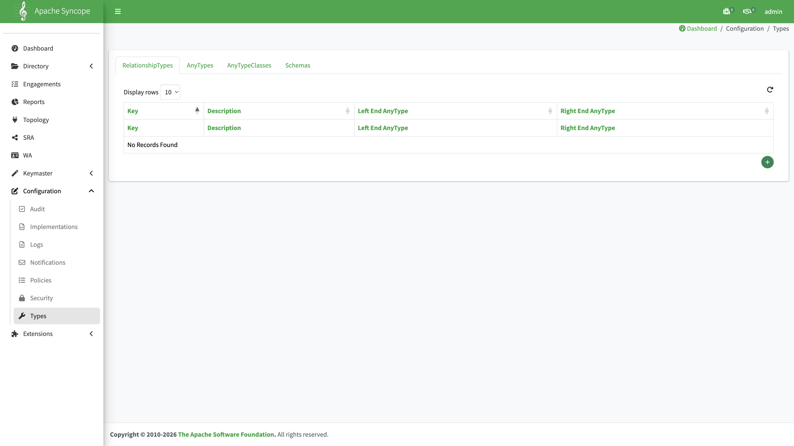
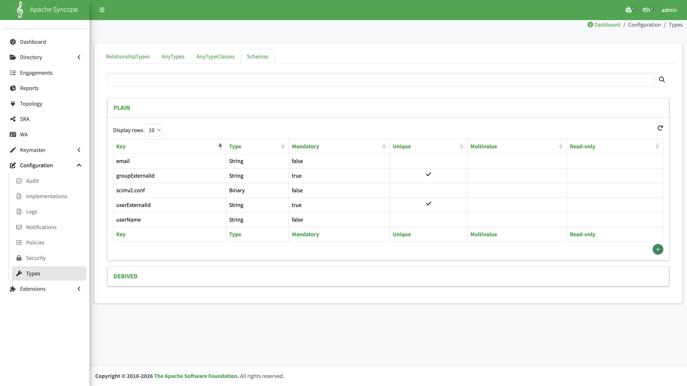
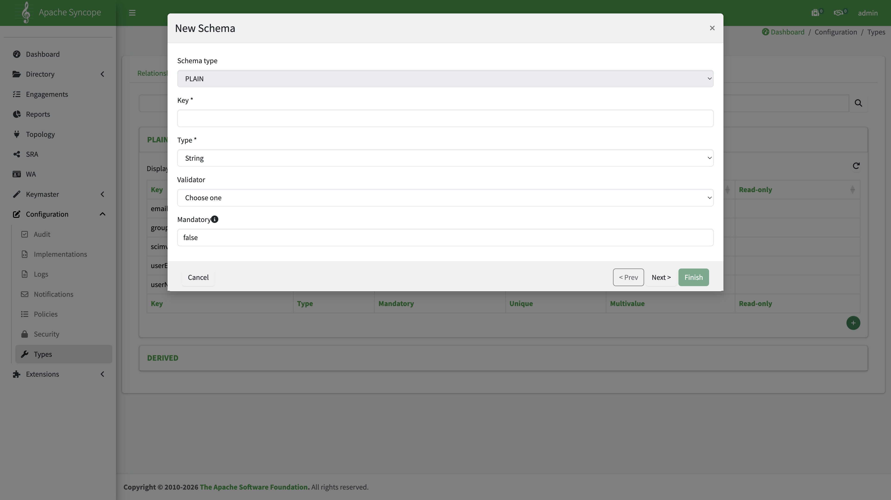
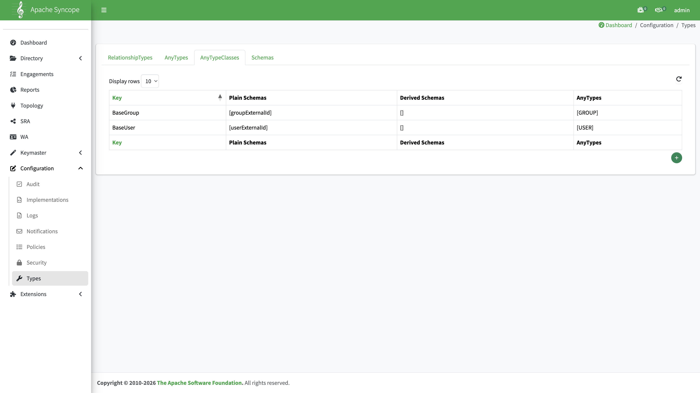
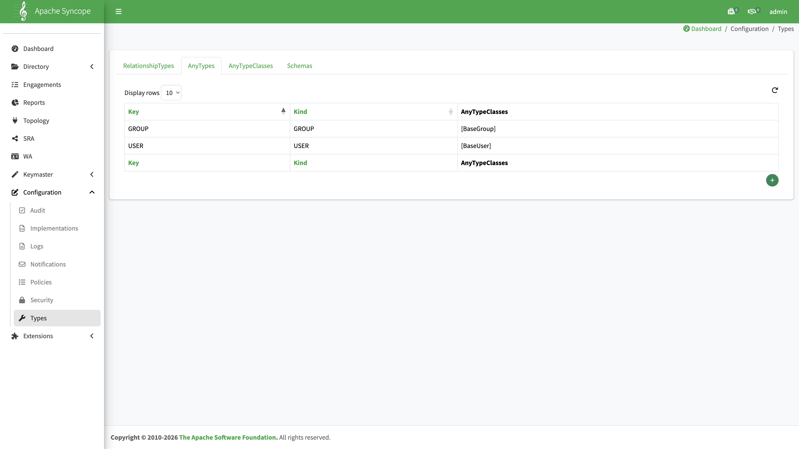

# Configuring Types for Azure and Gravitino Integration

Part of the [Azure + Gravitino scenario](overview.md) (step 2).

This guide explains how to configure **Configuration → Types** in the Apache Syncope Console for an Azure + Gravitino integration scenario.

Detailed build, deploy, and connector steps live in the linked guides — not duplicated here.

## Accessing the Console

All steps below are performed in the **Syncope Console** UI. The navigation path is the same regardless of how Syncope is deployed.

**Navigation:** `Configuration → Types`

Open the Console using the base URL for your environment. The Console web application is usually deployed at the `/syncope-console/` context path.



Log in with `admin` / `password` (see [Build and deploy — Console access](../../build/build-and-deploy.md#console-access)).

## What Types is for

**Types defines Syncope's internal data model** — the custom attributes that Users and Groups can store. It does **not** configure connectors, external resources, or sync tasks.

```text
Schemas (field definitions)
    ↓ attached to
AnyTypeClasses (field groups)
    ↓ attached to
AnyTypes (which groups USER / GROUP use)
    ↓ optional
RelationshipTypes (relationships between objects; not needed for Azure + Gravitino)
```

### How Types relates to Azure and Gravitino

| External system          | Role of Types                                                                     |
|:-------------------------|:----------------------------------------------------------------------------------|
| **Azure SCIM inbound**   | Store Azure Object IDs in `userExternalId` / `groupExternalId`                    |
| **Azure Pull connector** | Same fields; attribute mapping is configured in **Topology**, not in Types        |
| **Gravitino REST Push**  | Maps `userExternalId` → Gravitino `name` (Azure Pull path); group `name` → `name` |

## Configuration order

When building the model from scratch, follow this order:

```text
① Schemas  →  ② AnyTypeClasses  →  ③ AnyTypes  →  ④ RelationshipTypes (skip)
```

---

## Tab 1: Schemas

**Path:** `Configuration → Types → Schemas`

Schemas are split into **PLAIN** (direct attributes) and **DERIVED** (computed attributes). Azure + Gravitino integration mainly uses PLAIN schemas.



### Recommended PLAIN schemas

| Key               | Type   | Mandatory | Unique | Purpose                                               |
|:------------------|:-------|:---------:|:------:|:------------------------------------------------------|
| `email`           | String |   false   | false  | Email address; target for SCIM `emails` mapping       |
| `userExternalId`  | String |    true   |  true  | Azure user Object ID                                  |
| `groupExternalId` | String |    true   |  true  | Azure group Object ID                                 |
| `userName`        | String |   false   | false  | Optional helper for SCIM `userName`                   |
| `scimv2.conf`     | Binary |   false   | false  | Internal SCIM extension storage; do not edit manually |

### Creating `userExternalId`

1. Go to **Configuration → Types → Schemas**.
2. In the **PLAIN** section, click **+**.
3. Set the fields as follows:



| Field      | Value                                                        |
|:-----------|:-------------------------------------------------------------|
| Key        | `userExternalId`                                             |
| Type       | `String`                                                     |
| Mandatory  | `true`                                                       |
| Unique     | `true`                                                       |
| Multivalue | `false`                                                      |
| Read-only  | `false` (SCIM provisioning must be able to write this field) |

4. Click **Save**.

### Creating `groupExternalId`

1. Go to **Configuration → Types → Schemas**.
2. In the **PLAIN** section, click **+**.
3. Set Key to `groupExternalId`, Type `String`, Mandatory `true`, Unique `true`, Multivalue `false`, Read-only `false`.
4. Click **Save**.

### About `scimv2.conf`

The `scimv2.conf` Binary schema is created automatically when you save settings under **Extensions → SCIM 2.0**. You do not need to create it manually in the Schemas tab.

---

## Tab 2: AnyTypeClasses

**Path:** `Configuration → Types → AnyTypeClasses`



| Key         | Plain Schemas                                    | AnyTypes |
|:------------|:-------------------------------------------------|:--------:|
| `BaseUser`  | `userExternalId`, `email` (optional: `userName`) |  `USER`  |
| `BaseGroup` | `groupExternalId`                                | `GROUP`  |

Create or edit each class; attach the Plain Schemas listed above.

---

## Tab 3: AnyTypes

**Path:** `Configuration → Types → AnyTypes`



| Key     |  Kind | AnyTypeClasses |
|:--------|:-----:|:---------------|
| `USER`  |  USER | `[BaseUser]`   |
| `GROUP` | GROUP | `[BaseGroup]`  |

Assign `BaseUser` to `USER` and `BaseGroup` to `GROUP`.

---

## Tab 4: RelationshipTypes

**Path:** `Configuration → Types → RelationshipTypes`

Not required for Azure + Gravitino integration. Leave this tab empty.

## Next step

[Pull and push basics](pull-push-basics.md) → then [SCIM provisioning](configure-scim-provisioning.md) and [Gravitino REST Push](configure-gravitino-push.md).

## Index

[Azure + Gravitino scenario](overview.md)
