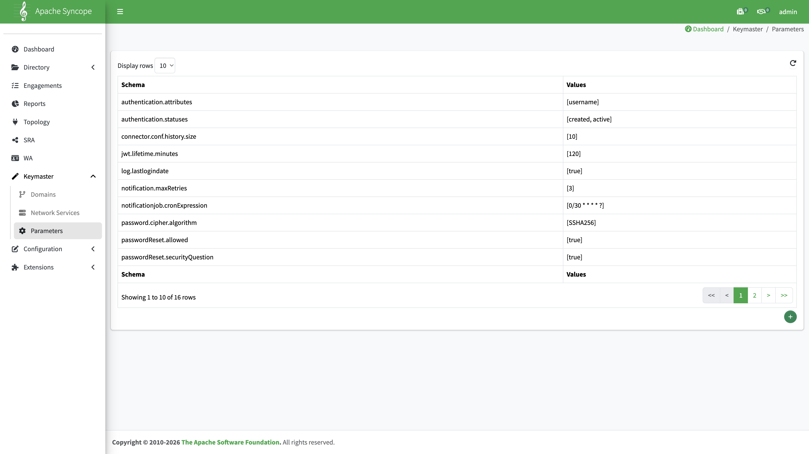
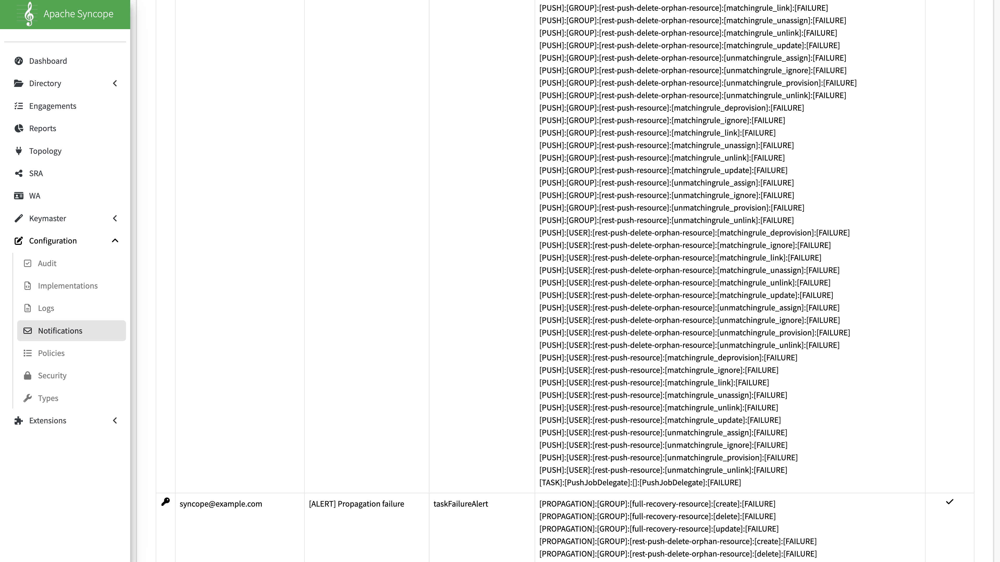
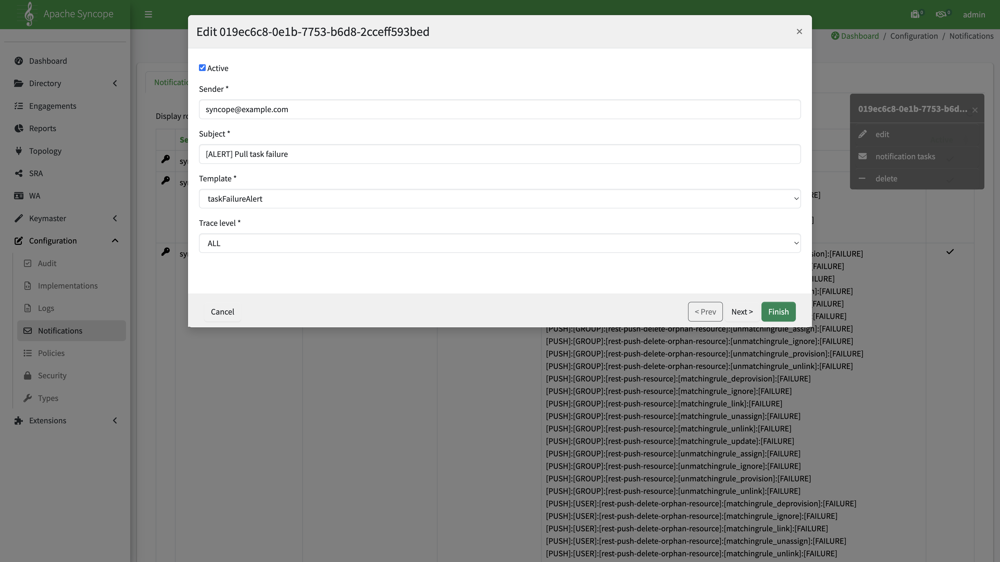
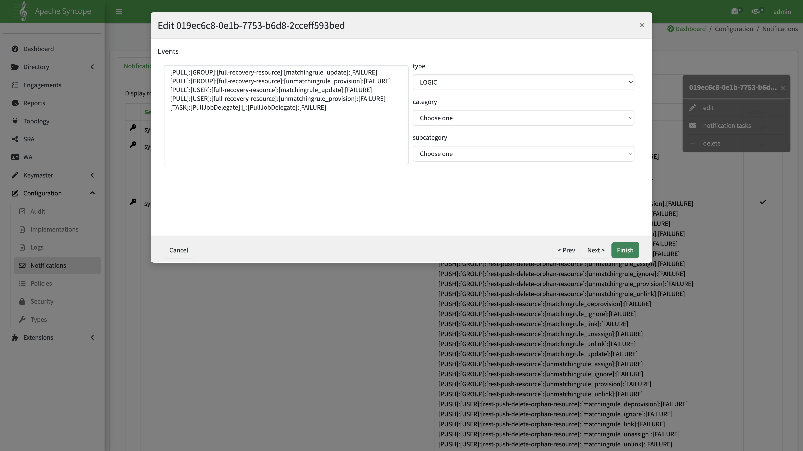

# Configure Email Notifications

Configure **notification rules** and the **notification job** in the Syncope Console so task and propagation failures send email alerts.

**Prerequisite:** Core must already be able to send mail (SMTP configured during [Build and deploy](../../build/build-and-deploy.md)). This guide covers Console settings only — not SMTP or container deployment.

Examples use the Docker Compose stack: Console **http://127.0.0.1:28080/syncope-console/**.

## How alerting works

Syncope does not attach email settings to individual Push/Pull tasks. Instead:

1. A failing task or propagation writes **audit events**.
2. **Notification** rules match those events and enqueue notification tasks.
3. The **notification job** (driven by `notificationjob.cronExpression`) sends mail using a **mail template**.

```text
Task / propagation FAILURE  →  audit event  →  Notification rule  →  notification job  →  email
```

## Configuration order

```text
Enable notification job (Keymaster → Parameters)
  →  Create mail template
  →  Create Notification rules (events + recipients)
  →  Restart Core (after changing cron expression)
```

---

## Step 1 — Enable the notification job

Default `notificationjob.cronExpression` is **empty** (notification delivery disabled).

1. Sign in to the Console as administrator.
2. Open **Keymaster** → **Parameters**.
3. Set `notificationjob.cronExpression` to a Quartz cron expression, for example `0/30 * * * * ?` (every 30 seconds — useful for testing; use a slower schedule in production).
4. **Restart Core** so the new schedule takes effect.



---

## Step 2 — Mail template

**Configuration** → **Notifications** → **Mail templates** → **+**

| Field | Example            |
|:------|:-------------------|
| Key   | `taskFailureAlert` |

Add **HTML** and **TEXT** bodies. Placeholders such as `${type}`, `${category}`, `${subcategory}`, `${event}`, `${condition}`, and `${output.message}` are filled from the matched audit event.

Example HTML:

```html
<h3>Syncope task alert</h3>
<p><b>Event:</b> ${type} / ${category} / ${subcategory} / ${event} / ${condition}</p>
<pre>${output.message}</pre>
```

Example TEXT:

```text
Syncope task alert
Event: ${type} ${category} ${subcategory} ${event} ${condition}
${output.message}
```

---

## Step 3 — Notification rules (task failure alerts)

**Configuration** → **Notifications** → **+**

Create one notification per alert category. This guide watches **Pull, Push, and propagation** failures for the Azure + Gravitino resources — not platform scheduled housekeeping tasks.

### Common fields (all three rules)

| Field             | Example               |
|:------------------|:----------------------|
| Active            | Yes                   |
| Sender            | `syncope@example.com` |
| Static recipients | `ops@example.com`     |
| Template          | `taskFailureAlert`    |
| Trace level       | `ALL`                 |



### Rule 1 — `[ALERT] Pull task failure`

| Field   | Value                       |
|:--------|:----------------------------|
| Subject | `[ALERT] Pull task failure` |

**Events** — Pull failures on `full-recovery-resource` plus Pull job delegate failures:

| Event pattern                                                                  | Meaning                        |
|:-------------------------------------------------------------------------------|:-------------------------------|
| `[PULL]:[USER]:[full-recovery-resource]:[matchingrule_update]:[FAILURE]`       | Pull reconcile failure (USER)  |
| `[PULL]:[USER]:[full-recovery-resource]:[unmatchingrule_provision]:[FAILURE]`  | Pull provision failure (USER)  |
| `[PULL]:[GROUP]:[full-recovery-resource]:[matchingrule_update]:[FAILURE]`      | Pull reconcile failure (GROUP) |
| `[PULL]:[GROUP]:[full-recovery-resource]:[unmatchingrule_provision]:[FAILURE]` | Pull provision failure (GROUP) |
| `[TASK]:[PullJobDelegate]:[]:[PullJobDelegate]:[FAILURE]`                      | Pull task job failure          |





### Rule 2 — `[ALERT] Push task failure`

| Field   | Value                       |
|:--------|:----------------------------|
| Subject | `[ALERT] Push task failure` |

**Events** — Push failures on both push resources (`rest-push-resource`, `rest-push-delete-orphan-resource`) for USER and GROUP, across matching and unmatching rules, plus:

| Event pattern                                             | Meaning               |
|:----------------------------------------------------------|:----------------------|
| `[TASK]:[PushJobDelegate]:[]:[PushJobDelegate]:[FAILURE]` | Push task job failure |

Matching-rule suffixes: `matchingrule_update`, `matchingrule_deprovision`, `matchingrule_unassign`, `matchingrule_link`, `matchingrule_unlink`, `matchingrule_ignore`.

Unmatching-rule suffixes: `unmatchingrule_assign`, `unmatchingrule_provision`, `unmatchingrule_unlink`, `unmatchingrule_ignore`.

### Rule 3 — `[ALERT] Propagation failure`

| Field   | Value                         |
|:--------|:------------------------------|
| Subject | `[ALERT] Propagation failure` |

**Events** — Propagation create/update/delete failures on **`rest-push-resource`** only (the resource assigned via [realm templates](configure-incremental-data-import.md) for incremental Gravitino sync).

Do **not** add `rest-push-delete-orphan-resource` or `full-recovery-resource` here: orphan cleanup uses a **Push task**, and Azure Pull failures are covered by Rule 1.

For USER and GROUP, add events for operations `create`, `update`, and `delete`:

```text
[PROPAGATION]:[USER|GROUP]:[rest-push-resource]:[create|update|delete]:[FAILURE]
```

---

## Tasks covered (reference domain)

Alerts watch these **existing** tasks:

| Type | Task name                      | Resource                           | Import path |
|:-----|:-------------------------------|:-----------------------------------|:------------|
| PUSH | `rest-push-task`               | `rest-push-resource`               | Incremental |
| PUSH | `rest-push-delete-orphan-task` | `rest-push-delete-orphan-resource` | Full        |
| PULL | `full-recovery-task`           | `full-recovery-resource`           | Full        |

Used with [Overview — Scenario 2](overview.md#scenario-2-alert-and-data-recovery): on `[ALERT]` mail, follow [Configure full data import](configure-full-data-import.md) (pause SCIM → Azure Pull → orphan push). Day-to-day failures on the incremental path are covered by Push Rule 2 (`rest-push-task`) and Propagation Rule 3.

---

## Verify in Console

| Check                    | Where                                                                                                                                 |
|:-------------------------|:--------------------------------------------------------------------------------------------------------------------------------------|
| Notification job enabled | **Keymaster** → **Parameters** → `notificationjob.cronExpression` non-empty                                                           |
| Template exists          | **Configuration** → **Notifications** → **Mail templates** → `taskFailureAlert`                                                       |
| Rules active             | **Configuration** → **Notifications** — three `[ALERT]` rows (Pull, Push, Propagation)                                                |
| Event match              | Open a rule → **Events** tab — patterns listed above                                                                                  |
| Delivery                 | Trigger a known failure (for example, run `full-recovery-task` with invalid connector credentials) and confirm mail at your SMTP sink |

---

## Reference

- [Apache Syncope notification e-mails](https://www.tirasa.net/en/blog/apache-syncope-notification-e-mails)
- Upstream: `src/main/asciidoc/reference-guide/configuration/email.adoc`

## Index

[Azure + Gravitino overview](overview.md) · [Build and deploy](../../build/build-and-deploy.md) (SMTP prerequisite)
