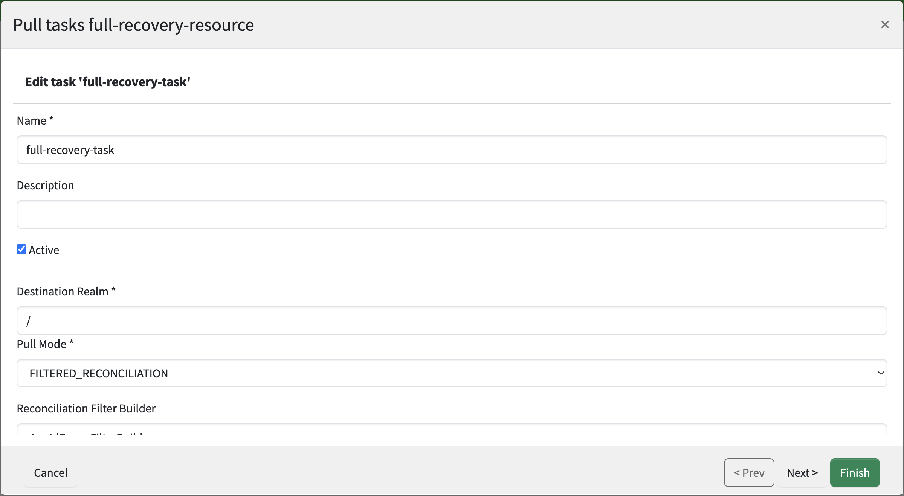
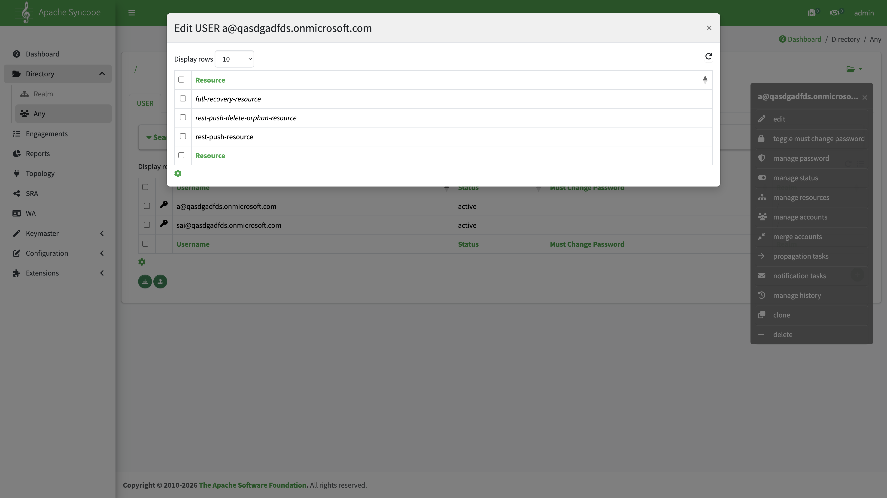
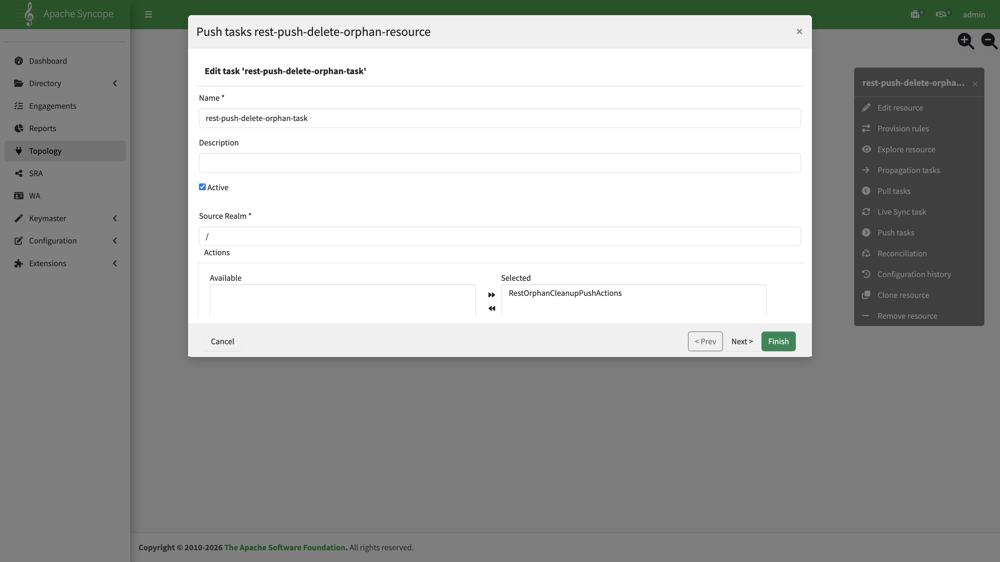

# Configure full data import (Azure Pull + orphan cleanup)

Recovery and full re-import from Entra use **two steps only**:

| Step | Mechanism                      | Task                                                                 |
|:----:|:-------------------------------|:---------------------------------------------------------------------|
|  1   | Azure Pull (inbound)           | `full-recovery-task` on `full-recovery-resource`                     |
|  2   | Orphan cleanup push (outbound) | `rest-push-delete-orphan-task` on `rest-push-delete-orphan-resource` |

This path does **not** use [SCIM provisioning](configure-scim-provisioning.md), [Propagation](configure-incremental-data-import.md), or **`rest-push-task`**. Day-to-day sync (SCIM + Propagation + `rest-push-task`) is covered by [incremental data import](configure-incremental-data-import.md).

**Prerequisites:**

1. [Gravitino REST Push](configure-gravitino-push.md) — connector, `rest-push-delete-orphan-resource`, and `rest-push-delete-orphan-task` (including `RestOrphanCleanupPushActions`).
2. [Azure Pull connector](configure-azure-pull.md) — `azure-pull-connector`, `full-recovery-resource`, `full-recovery-task`.

Examples use the Docker Compose environment from [Build and deploy](../../build/build-and-deploy.md): Console **http://127.0.0.1:28080/syncope-console/**, Core REST **http://127.0.0.1:18080/syncope/rest/**.

## Full import vs incremental import

|                 | **Full import** (this guide)           | **Incremental import** ([incremental guide](configure-incremental-data-import.md)) |
|:----------------|:---------------------------------------|:-----------------------------------------------------------------------------------|
| **Inbound**     | Azure Pull — `full-recovery-task`      | SCIM provisioning                                                                  |
| **Outbound**    | `rest-push-delete-orphan-task`         | Propagation + `rest-push-task` on `rest-push-resource`                             |
| **Typical use** | Recovery, full re-reconcile from Entra | Day-to-day Entra → Syncope → Gravitino                                             |

## End-to-end flow

```text
Entra ID
  → Azure Pull (full-recovery-task) → Syncope USER / GROUP
  → rest-push-delete-orphan-task (remove Gravitino orphans)
```

See [Overview — Scenario 2](overview.md#scenario-2-alert-and-data-recovery) for alert-driven recovery context.

## Step 1 — Run Azure Pull (`full-recovery-task`)

Task definition: [Azure Pull — Pull tasks](configure-azure-pull.md#pull-tasks-on-full-recovery-resource).

**Topology** → `full-recovery-resource` → **Pull tasks** → select `full-recovery-task` → execute (play icon), or use REST:

```bash
curl -k -u admin:password -H 'X-Syncope-Domain: Master' \
  -X POST 'http://127.0.0.1:18080/syncope/rest/tasks/{taskKey}/execute' \
  -H 'Content-Type: application/json' -d '{}'
```

Replace `{taskKey}` with the pull task key from the Console or `GET /pullTasks`.



Confirm execution succeeds in the task details panel. Azure Pull maps **`mailNickname`** into `userExternalId` (not the SCIM object ID) — see [push guide — Attribute mappings](configure-gravitino-push.md#attribute-mappings) if you also run the incremental path.

## Step 2 — Orphan cleanup (`rest-push-delete-orphan-task`)

Do **not** run `rest-push-task`. Remove Gravitino users and groups that no longer exist in Syncope with the orphan cleanup push only.

### Assign `rest-push-delete-orphan-resource`

**Directory** → select users/groups → **External resources** → assign `rest-push-delete-orphan-resource`.



Task definition: [Gravitino REST Push — orphan resource](configure-gravitino-push.md#resource-rest-push-delete-orphan-resource).



Do **not** add `rest-push-delete-orphan-resource` to realm templates.

### Execute

**Topology** → `rest-push-delete-orphan-resource` → **Push tasks** → select `rest-push-delete-orphan-task` → execute (play icon), or use REST:

```bash
curl -k -u admin:password -H 'X-Syncope-Domain: Master' \
  -X POST 'http://127.0.0.1:18080/syncope/rest/tasks/{taskKey}/execute' \
  -H 'Content-Type: application/json' -d '{}'
```

Replace `{taskKey}` with the push task key from the Console or `GET /pushTasks`.

Check the latest execution message. `HTTP 409` on re-run often means the remote object was already removed.

## When to use this guide

| Situation                                            | Full import | Incremental import |
|:-----------------------------------------------------|:------------|:-------------------|
| Full re-import from Entra via Azure Pull             | Yes         | No                 |
| Alert-driven disaster recovery                       | Yes         | No                 |
| Daily Entra → Syncope sync                           | No          | Yes (SCIM)         |
| Syncope → Gravitino (Propagation + `rest-push-task`) | No          | Yes                |

## Index

[Azure + Gravitino scenario](overview.md) · [Azure Pull](configure-azure-pull.md) · [Incremental data import](configure-incremental-data-import.md) · [Gravitino REST Push](configure-gravitino-push.md)
