# Gravitino REST Push (Syncope → Gravitino)

Export users and groups from Syncope to Gravitino using the REST ConnId connector and Groovy provisioning scripts.

The examples below follow the deployment layout in [Build and deploy](../../build/build-and-deploy.md) (Console URL, Core REST base URL, Groovy script directory, and bundle location).

## Prerequisites

Complete these before creating the connector:

1. **Types** — `userExternalId` must exist on `USER`. With [SCIM provisioning](configure-scim-provisioning.md) (incremental path), map from Entra `externalId`; with [Azure Pull](configure-azure-pull.md) (full import path), `mailNickname` is mapped instead. See [Configure Types](configuration-types-azure-gravitino.md).
2. **Gravitino** — API reachable from Syncope Core; target metalake created. If the built-in IdP REST extension is enabled, set `gravitino.authenticators = oauth,basic` in `gravitino.conf`.
3. **Keycloak (or other OIDC provider)** — token endpoint reachable from Syncope; OIDC client configured for **password** (resource owner) and/or **client_credentials**.
4. **Gravitino authorization** — set `gravitino.authorization.enable = true` in `gravitino.conf` when using user/group REST APIs. With **password** grant, add the Keycloak user from connector **Username** to the target metalake; with **client_credentials**, ensure the JWT service-account principal for your OIDC client is allowed on that metalake — otherwise create operations return HTTP 403 or 405.
5. **Groovy scripts** — deploy under Syncope Core (`{scriptDir}/` on your deployment; see [Build and deploy](../../build/build-and-deploy.md)). Reference sources: `fit/core-reference/src/test/resources/gravitino/`.
6. **REST ConnId bundle** — use `net.tirasa.connid.bundles.rest` **1.1.1-SNAPSHOT** (or newer). The SNAPSHOT bundle supports `accessTokenGrantType` / `accessTokenScope`; older `1.1.1` bundles without those fields cannot obtain OAuth tokens from Keycloak.
7. **Implementation** — register `RestOrphanCleanupPushActions` before creating the orphan push task (see below).

| Script                    | Role                                        |
|:-------------------------|:-------------------------------------------|
| `CreateScript.groovy`     | POST users/groups to Gravitino              |
| `DeleteScript.groovy`     | DELETE users/groups                         |
| `SearchScript.groovy`     | SEARCH / reconcile (normal push resource)   |
| `ListSearchScript.groovy` | List-based search (orphan cleanup resource) |

## Configuration order

```text
Types  →  Gravitino + Keycloak ready  →  Deploy Groovy scripts
  →  Register RestOrphanCleanupPushActions
  →  Create rest-push-connector
  →  rest-push-resource (overrides, provision, mappings, rest-push-task)
  →  rest-push-delete-orphan-resource (overrides, provision, rest-push-delete-orphan-task)
  →  Assign resources  →  See incremental / full import guides for execution
```

## Topology overview

Create one REST connector and **two** resources beneath it:

| Object                      | Name                               | Push task                      |
|:---------------------------|:----------------------------------|:------------------------------|
| Connector display name      | `rest-push-connector`              | —                              |
| Resource (incremental push) | `rest-push-resource`               | `rest-push-task`               |
| Resource (orphan cleanup)   | `rest-push-delete-orphan-resource` | `rest-push-delete-orphan-task` |

**Topology** → expand your bundle **Location** (see [Build and deploy](../../build/build-and-deploy.md)) → `rest-push-connector` → two child resources.

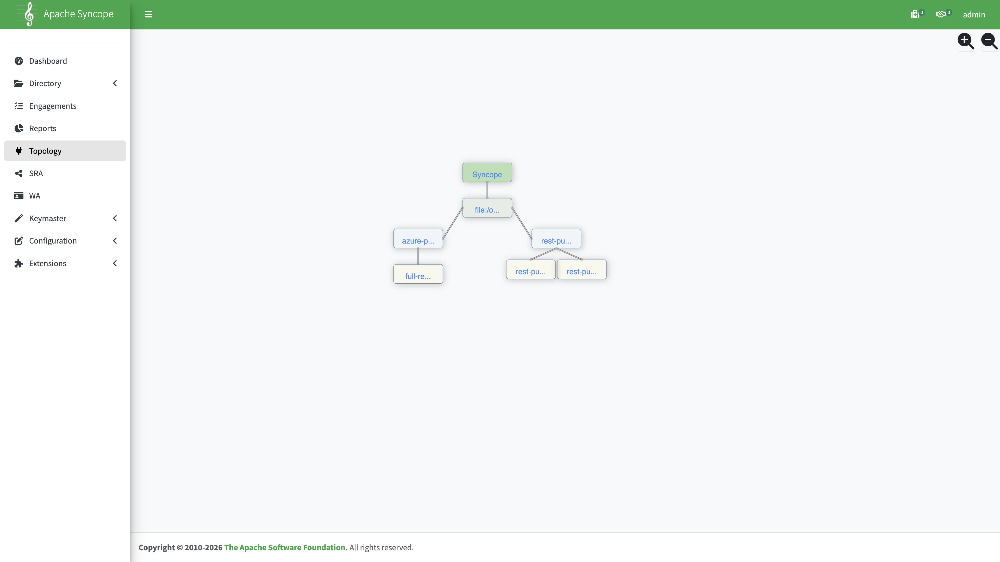

## Register `RestOrphanCleanupPushActions`

**Configuration → Implementations → PUSH_ACTIONS → +**

| Field  | Value                                                                             |
|:------|:---------------------------------------------------------------------------------|
| Key    | `RestOrphanCleanupPushActions`                                                    |
| Engine | `JAVA`                                                                            |
| Body   | `org.apache.syncope.core.provisioning.java.pushpull.RestOrphanCleanupPushActions` |

Fresh domains may already include this implementation from default content; verify it exists before creating `rest-push-delete-orphan-task`.

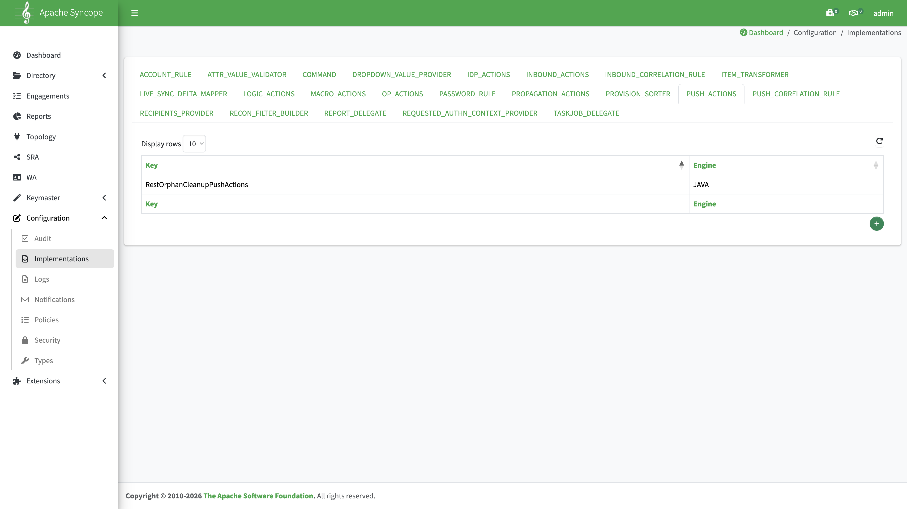

## Connector: `rest-push-connector`

**Topology** → your bundle **Location** → **+** → select bundle `net.tirasa.connid.bundles.rest` → connector `RESTConnector` → version **1.1.1-SNAPSHOT**.

Set **Display name** to `rest-push-connector`.

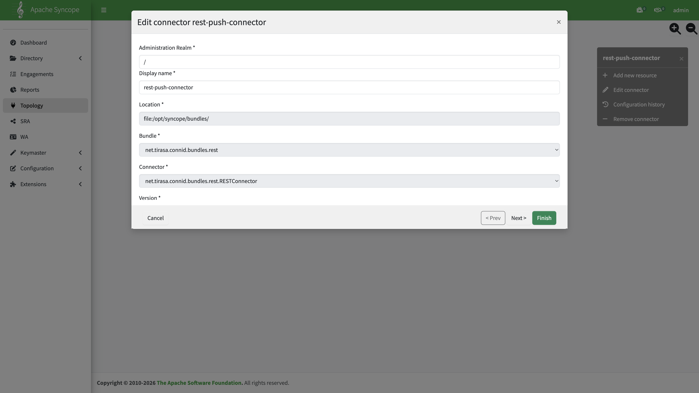

### Required connector settings

The REST bundle (`RESTConnector`) selects the authentication mode at connector startup:

| Mode            | When it applies                                                                                             | API calls to **Base Address**                         |
|:---------------|:-----------------------------------------------------------------------------------------------------------|:-----------------------------------------------------|
| **OAuth2 auth** | `Client Id`, `Client Secret`, **Access Token base address**, and **Access Token node id** are all non-empty | `Authorization: Bearer …` (token from token endpoint) |
| **Basic auth**  | OAuth2 fields above are **not** all set, and **Username** / **Password** are set                            | HTTP Basic (`Authorization: Basic …`)                 |
| **Simple auth** | OAuth2 fields are **not** all set, and **Username** / **Password** are empty                                | No `Authorization` header                             |

Logic reference: `ConnIdRESTBundle` → `RESTConnector.init()`.

#### Common settings (all auth modes)

On the connector configuration page, set (replace placeholders with your Gravitino host, metalake, and script paths — see [Build and deploy](../../build/build-and-deploy.md) for Docker vs local layouts):

| Parameter                     | Value                                                                 | Notes                                                   |
|:-----------------------------|:---------------------------------------------------------------------|:-------------------------------------------------------|
| **Base Address**              | `http://{gravitinoHost}:{gravitinoPort}/api/metalakes/{metalakeName}` | Gravitino metalake REST base URL                        |
| **Accept**                    | `application/json`                                                    |                                                         |
| **Content-Type**              | `application/json`                                                    |                                                         |
| **scriptingLanguage**         | `GROOVY`                                                              |                                                         |
| **reloadScriptOnExecution**   | `true`                                                                | Reload Groovy scripts on each task run                  |
| **clearTextPasswordToScript** | `true`                                                                | Pass decrypted password into Groovy scripts when needed |
| **createScriptFileName**      | `{scriptDir}/CreateScript.groovy`                                     | Absolute path on Syncope Core                           |
| **deleteScriptFileName**      | `{scriptDir}/DeleteScript.groovy`                                     | Same as above                                           |
| **searchScriptFileName**      | `{scriptDir}/SearchScript.groovy`                                     | Same as above                                           |
| **Conn request timeout**      | `10`                                                                  | Seconds                                                 |

Enable **Override** on connector-level values that resources will override (`baseAddress`, script paths, `reloadScriptOnExecution`).

On the capabilities step, enable: **CREATE**, **DELETE**, **SEARCH**.

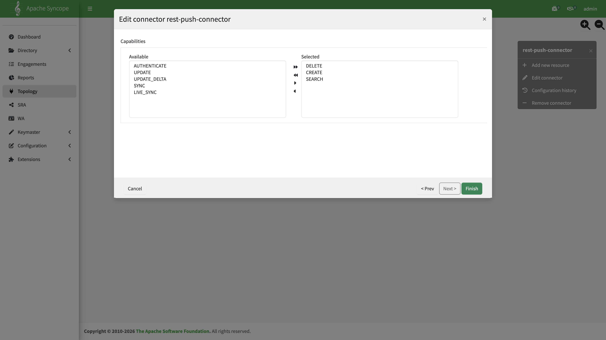

#### OAuth2 auth

**Used in the Azure + Gravitino scenario** (Gravitino API + Keycloak token endpoint).

Set **all four** OAuth fields below. The connector obtains an access token from the token endpoint and sends `Authorization: Bearer …` on each call to **Base Address**. Username and password are **not** sent as HTTP Basic on the Gravitino API.

**Shared OAuth2 settings** (both grant types):

| Parameter                     | Value                                                                           | Notes                            |
|:-----------------------------|:-------------------------------------------------------------------------------|:--------------------------------|
| **Client Id**                 | Your OIDC client id                                                             | From Keycloak (or other IdP)     |
| **Client Secret**             | Your OIDC client secret                                                         |                                  |
| **Access Token node id**      | `access_token`                                                                  | JSON field in the token response |
| **Access Token base address** | `http://{oidcHost}:{oidcPort}/realms/{realmName}/protocol/openid-connect/token` | OIDC token URL                   |
| **Access Token Content-Type** | `application/x-www-form-urlencoded`                                             |                                  |

Choose **one** grant type below and set **Access Token grant type** accordingly.

##### Password grant (username and password)

Resource-owner password credentials (ROPC). Keycloak must allow the **password** grant on your OIDC client. The token request body includes `grant_type`, `client_id`, `client_secret`, `username`, `password`, and optionally `scope`.

| Parameter                   | Value                     | Notes                                                                              |
|:---------------------------|:-------------------------|:----------------------------------------------------------------------------------|
| **Access Token grant type** | `password`                | Required for ROPC — omitting this causes `Missing form parameter: grant_type`      |
| **Access Token scope**      | *(optional)*              | Sent only when non-empty; omit or leave blank if your IdP does not require a scope |
| **Username**                | Your Keycloak user        | JWT `preferred_username` is this value                                             |
| **Password**                | Password for **Username** |                                                                                    |

The Gravitino principal is the Keycloak user from **Username**. That user must exist in the target metalake when authorization is enabled.

##### Client credentials grant

Machine-to-machine OAuth. Keycloak must allow the **client_credentials** grant on your OIDC client. The token request body includes only `grant_type`, `client_id`, and `client_secret` — leave **Username** and **Password** empty.

| Parameter                   | Value                | Notes                         |
|:---------------------------|:--------------------|:-----------------------------|
| **Access Token grant type** | `client_credentials` |                               |
| **Access Token scope**      | *(empty)*            | Usually omitted               |
| **Username**                | *(empty)*            | Not used in the token request |
| **Password**                | *(empty)*            | Not used in the token request |

The Gravitino principal is the OIDC service account for **Client Id** (JWT `preferred_username` is typically `service-account-{clientId}`). Ensure that principal is authorized on the target metalake when authorization is enabled.

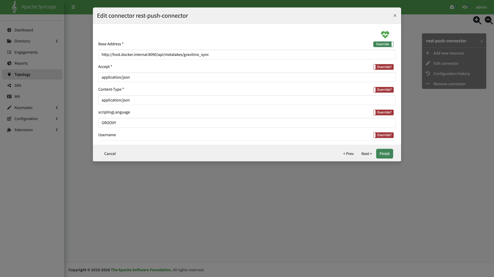

**Environment-specific URLs (OAuth2)**

Use hostnames and ports reachable **from Syncope Core** (inside the container, pod, or local JVM):

| Deployment                | Gravitino **Base Address**                                            | **Access Token base address**                                                   |
|:-------------------------|:---------------------------------------------------------------------|:-------------------------------------------------------------------------------|
| Docker Compose            | `http://{gravitinoHost}:{gravitinoPort}/api/metalakes/{metalakeName}` | `http://{oidcHost}:{oidcPort}/realms/{realmName}/protocol/openid-connect/token` |
| Local Tomcat / standalone | Hostname reachable from the Syncope Core JVM                          | Same constraint for the OIDC token endpoint                                     |
| Kubernetes                | Service or ingress URL reachable from the Syncope pod                 | Same constraint for the OIDC token endpoint                                     |

#### Basic auth

Use when the target REST API expects **HTTP Basic** on **Base Address** and you do **not** use the OAuth2 token flow.

Leave **empty**: **Client Id**, **Client Secret**, **Access Token base address**, **Access Token node id** (and related Access Token fields).

| Parameter    | Notes                                               |
|:------------|:---------------------------------------------------|
| **Username** | Sent as HTTP Basic on each call to **Base Address** |
| **Password** | Sent as HTTP Basic on each call to **Base Address** |

The connector builds the client with `WebClient.create(baseAddress, …, username, password, …)` — no Bearer token is requested.

#### Simple auth

Use when **Base Address** accepts unauthenticated requests (no Bearer token, no HTTP Basic).

Leave **empty**:

- **Client Id**, **Client Secret**, **Access Token base address**, **Access Token node id** (and other Access Token fields)
- **Username**, **Password**

The connector calls **Base Address** without an `Authorization` header. Only suitable if Gravitino (or your target) allows anonymous access on the configured API path.

---

Local standalone: copy Groovy scripts to your Core classpath directory for `{scriptDir}` and point script file names at those absolute paths. Set connector **Location** to your local bundles directory and use REST bundle **1.1.1-SNAPSHOT** only.

## Resource: `rest-push-resource`

**Topology** → `rest-push-connector` → **Add new resource** → name `rest-push-resource` → save.

### Connector configuration override

Open the resource → **Connector configuration override** → enable override and set:

| Parameter                   | Value                                    |
|:---------------------------|:----------------------------------------|
| **Base Address**            | Same Gravitino metalake URL as connector |
| **reloadScriptOnExecution** | `true`                                   |
| **createScriptFileName**    | `{scriptDir}/CreateScript.groovy`        |
| **deleteScriptFileName**    | `{scriptDir}/DeleteScript.groovy`        |
| **searchScriptFileName**    | `{scriptDir}/SearchScript.groovy`        |

Use absolute script paths in overrides (not unresolved `${…}` placeholders) when running outside the default Docker layout.

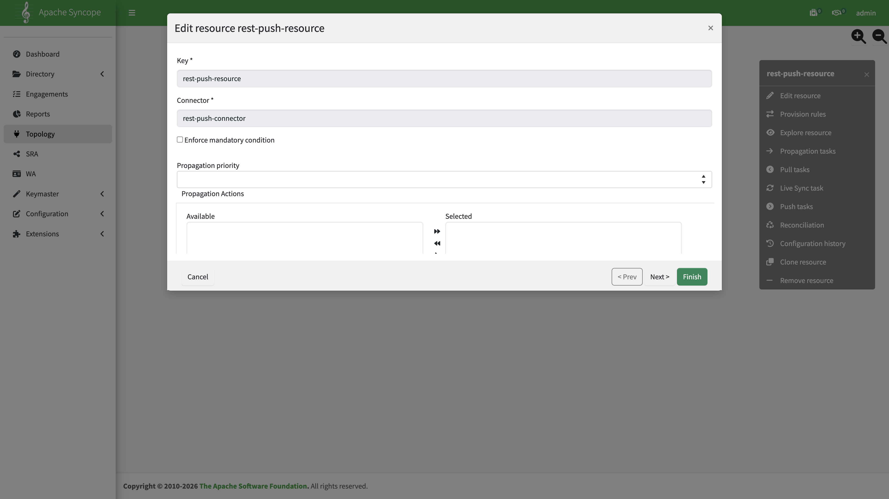

### Provision rules

Open **Provision rules** → add one row per AnyType:

| AnyType | Object class  |
|:-------|:-------------|
| USER    | `__ACCOUNT__` |
| GROUP   | `__GROUP__`   |

### Attribute mappings

**USER**

| Internal attribute | External attribute | Remote Key | Purpose |
|:------------------|:------------------|:----------:|:-------:|
| `userExternalId`   | `name`             |    Yes     |   Both  |

After [Azure Pull](configure-azure-pull.md), `userExternalId` holds the Entra mail nickname. Gravitino user `name` is therefore the short id, not the full UPN. No JEXL transform is required in this scenario.

If users arrive via [SCIM provisioning](configure-scim-provisioning.md) instead, `userExternalId` may be the Azure object ID — use `username` with JEXL `value.replaceAll('([^@]+)@.*', '$1')` on the external `name` mapping instead.

**GROUP**

| Internal attribute | External attribute | Remote Key | Purpose |
|:------------------|:------------------|:----------:|:-------:|
| `name`             | `name`             |    Yes     |   Both  |

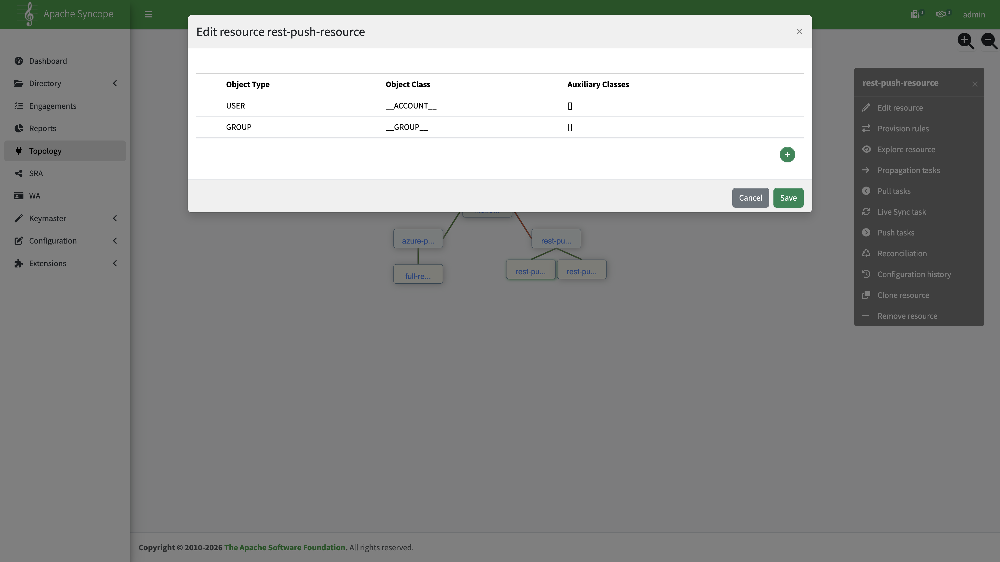

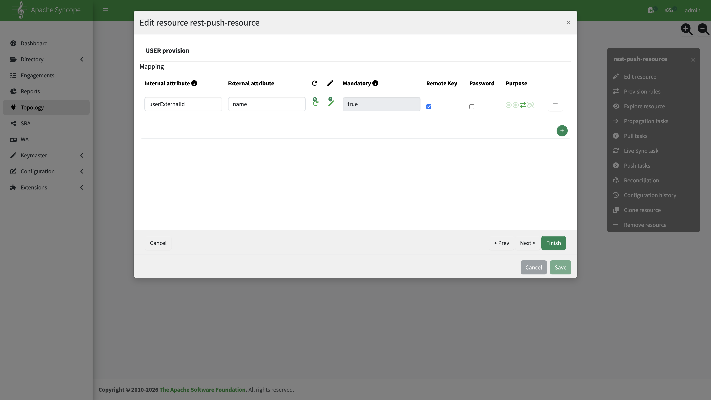

### Realm templates

Configure **Realm templates** for both USER and GROUP (assign realm `/` or your target realm). This enables incremental Propagation when users or groups change — see [Configure incremental data import](configure-incremental-data-import.md).

**Directory** → **Realm** → `/` → **template** in the context menu.

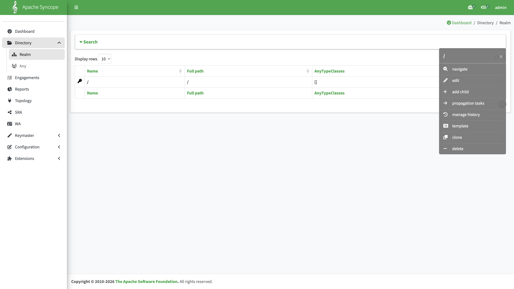

Realm templates and **`rest-push-task`** execution: [Configure incremental data import](configure-incremental-data-import.md).  
**`rest-push-delete-orphan-task`** execution (after Azure Pull): [Configure full data import](configure-full-data-import.md).

### Push task: `rest-push-task`

**Topology** → `rest-push-resource` → **Push tasks** → **+**

| Setting                          | Value                |
|:--------------------------------|:--------------------|
| Name                             | `rest-push-task`     |
| Resource                         | `rest-push-resource` |
| Active                           | Yes                  |
| Perform create / update / delete | Yes / Yes / Yes      |
| Sync status                      | No                   |
| Matching rule                    | `UPDATE`             |
| Unmatching rule                  | `ASSIGN`             |
| Destination realm                | `/`                  |
| Actions                          | *(none)*             |

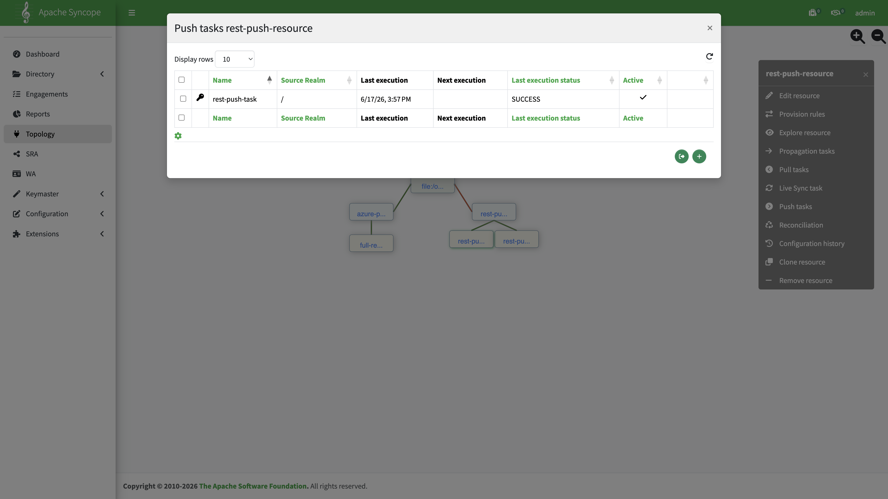

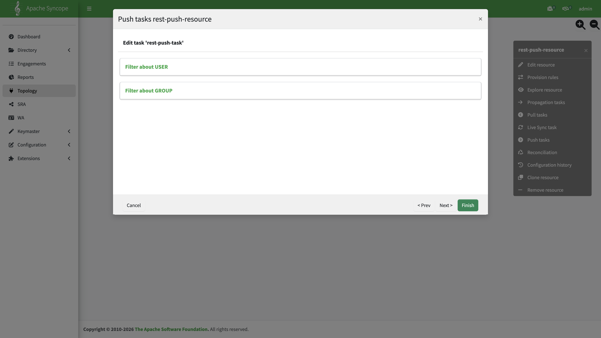

Run this task as part of [incremental data import](configure-incremental-data-import.md#step-3--run-rest-push-task).

## Resource: `rest-push-delete-orphan-resource`

Create a **second** resource under the same connector for orphan cleanup push.

| Field        | Value                              |
|:------------|:----------------------------------|
| Resource key | `rest-push-delete-orphan-resource` |
| Connector    | `rest-push-connector`              |

### Connector configuration override

Same overrides as `rest-push-resource`, except the **search** script — use `ListSearchScript.groovy` instead of `SearchScript.groovy`:

| Parameter                | Value                                 |
|:------------------------|:-------------------------------------|
| **searchScriptFileName** | `{scriptDir}/ListSearchScript.groovy` |

All other connector overrides (`baseAddress`, `reloadScriptOnExecution`, create/delete script paths) match `rest-push-resource`.

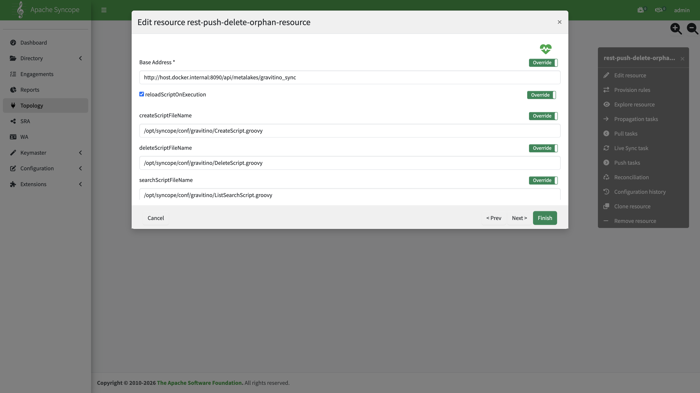

### Provision rules and attribute mappings

Use the same **Provision rules** and **USER** / **GROUP** attribute mappings as [`rest-push-resource`](#resource-rest-push-resource) above.

### Push task: `rest-push-delete-orphan-task`

**Topology** → `rest-push-delete-orphan-resource` → **Push tasks** → **+**

Same settings as `rest-push-task`, with these differences:

| Setting  | Value                              |
|:--------|:----------------------------------|
| Name     | `rest-push-delete-orphan-task`     |
| Resource | `rest-push-delete-orphan-resource` |
| Actions  | `RestOrphanCleanupPushActions`     |


Run this task as part of [full data import](configure-full-data-import.md#step-2--orphan-cleanup-rest-push-delete-orphan-task).

## Assign resources

| Resource                           | Import path                                  | Guide                                                                     |
|:----------------------------------|:--------------------------------------------|:-------------------------------------------------------------------------|
| `rest-push-resource`               | Incremental (Propagation + `rest-push-task`) | [Configure incremental data import](configure-incremental-data-import.md) |
| `rest-push-delete-orphan-resource` | Full (after Azure Pull)                      | [Configure full data import](configure-full-data-import.md)               |


## Index

[Azure + Gravitino scenario](overview.md)
