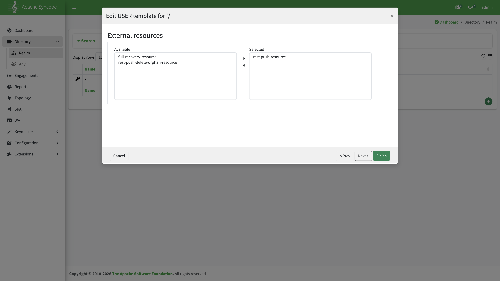
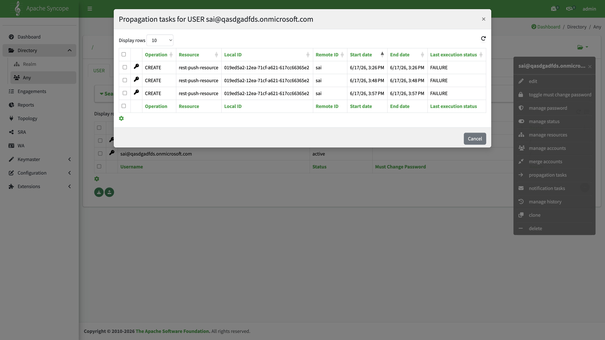

# Configure incremental data import (SCIM + Propagation + Push)

Day-to-day identity sync from Entra to Gravitino uses three mechanisms together:

| Layer                    | Mechanism                                           | Task / entry                                 |
|:-------------------------|:----------------------------------------------------|:---------------------------------------------|
| **Inbound**              | [SCIM provisioning](configure-scim-provisioning.md) | Entra → Syncope                              |
| **Outbound (real-time)** | Propagation on `rest-push-resource`                 | User/group → propagation tasks               |
| **Outbound (batch)**     | Push task `rest-push-task`                          | Topology → `rest-push-resource` → Push tasks |

Complete [Gravitino REST Push](configure-gravitino-push.md) first (connector, `rest-push-resource`, and `rest-push-task` definition). For recovery via Azure Pull, see [Configure full data import](configure-full-data-import.md) — that path uses **`full-recovery-task` + `rest-push-delete-orphan-task`** only, not SCIM, Propagation, or `rest-push-task`.

Examples use the Docker Compose environment from [Build and deploy](../../build/build-and-deploy.md): Console **http://127.0.0.1:28080/syncope-console/**, Core REST **http://127.0.0.1:18080/syncope/rest/**.

## Incremental vs full import

|                 | **Incremental** (this guide)                           | **Full import** ([full import guide](configure-full-data-import.md)) |
|:----------------|:-------------------------------------------------------|:---------------------------------------------------------------------|
| **Inbound**     | SCIM provisioning                                      | Azure Pull — `full-recovery-task`                                    |
| **Outbound**    | Propagation + `rest-push-task` on `rest-push-resource` | `rest-push-delete-orphan-task` only                                  |
| **Typical use** | Day-to-day Entra → Syncope → Gravitino                 | Recovery, full re-reconcile from Entra                               |

## End-to-end flow

```text
Entra ID ──SCIM──► Syncope (USER / GROUP)
                      │
                      ├── Propagation on rest-push-resource (per change)
                      └── rest-push-task on rest-push-resource (batch reconcile)
                      ▼
                 Gravitino metalake
```

Do **not** use `rest-push-delete-orphan-resource` or `rest-push-delete-orphan-task` on this path — those belong to [full data import](configure-full-data-import.md).

## Step 1 — SCIM inbound

Configure Entra → Syncope provisioning: SCIM mappings, PAT token, enterprise application.

→ [Configure SCIM provisioning](configure-scim-provisioning.md)

SCIM stores `userExternalId` / `groupExternalId` from Entra `externalId`. Plan Gravitino push mappings accordingly ([push guide — Attribute mappings](configure-gravitino-push.md#attribute-mappings)).

## Step 2 — Propagation (realm templates)

Propagation tasks are **created automatically** when an assigned entity on `rest-push-resource` needs a create, update, or delete on Gravitino. You do not define propagation tasks in Topology.

### Configure realm templates

**Directory** → **Realm** → select `/` (or your target realm) → context menu → **template**.


Choose **USER** or **GROUP**, open the edit wizard, and go to the **External resources** step. Move **`rest-push-resource`** to **Selected**.



Repeat for **GROUP** if groups should propagate to Gravitino automatically.

| Template | Selected resource (reference) | Notes                           |
|:---------|:------------------------------|:--------------------------------|
| USER     | `rest-push-resource`          | Incremental user create/delete  |
| GROUP    | `rest-push-resource`          | Incremental group create/delete |

Users created before the template was configured may lack the resource assignment. Assign **`rest-push-resource`** under **External resources** manually, then run **`rest-push-task`** (Step 3) or wait for the next SCIM change to trigger Propagation.

### What triggers propagation

| Event                   | Typical source            | Expected propagation                            |
|:------------------------|:--------------------------|:------------------------------------------------|
| User created            | SCIM, Console, REST       | **CREATE** on `rest-push-resource`              |
| User deleted            | SCIM deprovision, Console | **DELETE** on `rest-push-resource`              |
| User attribute change   | SCIM PATCH, Console edit  | **UPDATE** *(see caveat below)*                 |
| Group created / deleted | SCIM, Console             | **CREATE** / **DELETE** on `rest-push-resource` |

Entra SCIM incremental runs (every ~20–40 minutes) produce propagation tasks when the entity is assigned to `rest-push-resource`.

## Step 3 — Run `rest-push-task`

Task definition: [Gravitino REST Push — Push task](configure-gravitino-push.md#push-task-rest-push-task).

Use **`rest-push-task`** on `rest-push-resource` for batch reconcile — for example after enabling realm templates (backfill), on a schedule, or when Propagation cannot push attribute updates.

**Topology** → `rest-push-resource` → **Push tasks** → select `rest-push-task` → execute (play icon), or use REST:

```bash
curl -k -u admin:password -H 'X-Syncope-Domain: Master' \
  -X POST 'http://127.0.0.1:18080/syncope/rest/tasks/{taskKey}/execute' \
  -H 'Content-Type: application/json' -d '{}'
```

Replace `{taskKey}` with the task key from the Console or `GET /pushTasks`.


Successful create lines look like `CREATE SUCCESS (key/name): .../sai`. To run periodically, link the task under **Engagements → Scheduled Tasks** with a Quartz cron.

### REST connector capability caveat

The reference `rest-push-connector` exposes **CREATE**, **DELETE**, and **SEARCH** only — no **UPDATE** on individual Propagation operations. Attribute changes may produce propagation rows with **UPDATE** and status **NOT_ATTEMPTED** or **FAILURE**. Creates and deletes still propagate in real time; run **`rest-push-task`** to reconcile attribute changes in bulk.

## Monitor propagation

**Directory** → **Any** → select the user or group → context menu → **propagation tasks**.



| Column                    | Meaning                                                |
|:--------------------------|:-------------------------------------------------------|
| **Operation**             | `CREATE`, `UPDATE`, or `DELETE`                        |
| **Resource**              | e.g. `rest-push-resource`                              |
| **Remote ID**             | Gravitino-side identifier (e.g. from `userExternalId`) |
| **Last execution status** | `SUCCESS`, `FAILURE`, `NOT_ATTEMPTED`, etc.            |

| Location                                                       | Use                              |
|:---------------------------------------------------------------|:---------------------------------|
| **Engagements**                                                | Failed propagations (if enabled) |
| **Configuration → Logs**                                       | Core / connector stack traces    |
| REST `GET /tasks?type=PROPAGATION&resource=rest-push-resource` | Automation                       |

## Index

[Azure + Gravitino scenario](overview.md) · [SCIM provisioning](configure-scim-provisioning.md) · [Gravitino REST Push](configure-gravitino-push.md) · [Full data import](configure-full-data-import.md)
