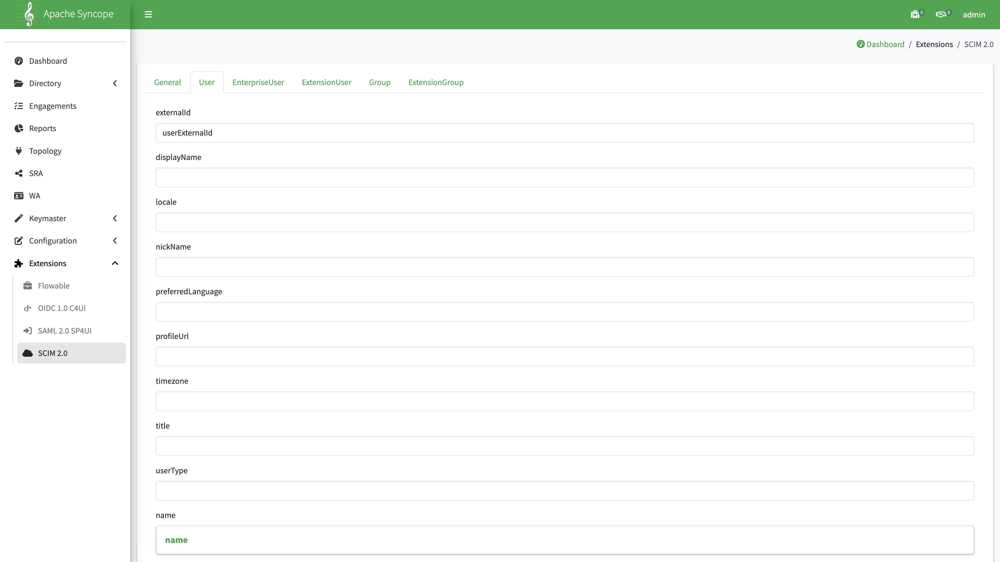
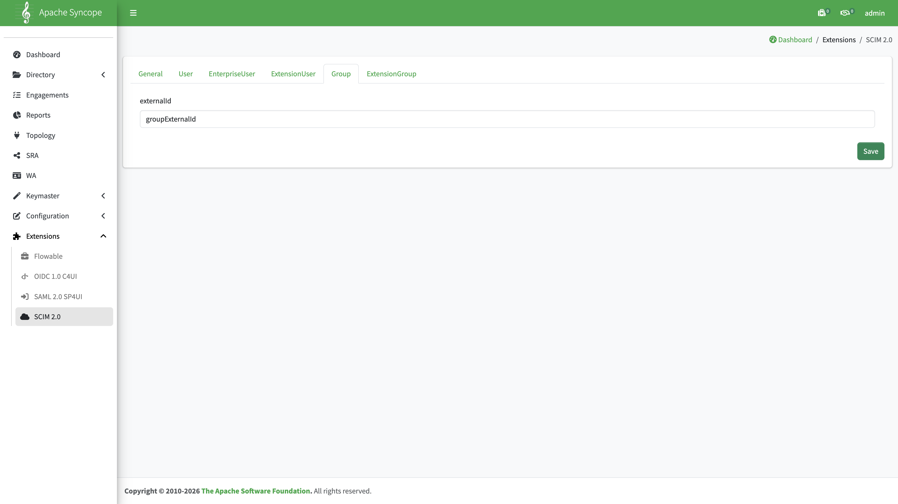

# SCIM Provisioning (Azure → Syncope)

Configure Syncope as a SCIM 2.0 endpoint so Microsoft Entra ID (or another IdP) can provision users and groups into Syncope.

Examples below use the Docker Compose stack from [Build and deploy](../../build/build-and-deploy.md): Console at **http://127.0.0.1:28080/syncope-console/**, Core REST at **http://127.0.0.1:18080/syncope/rest/**, SCIM endpoint at **http://127.0.0.1:18080/syncope/scim/v2/**.

## Prerequisites

Complete [Configure Types](configuration-types-azure-gravitino.md) first. At minimum you need:

| Schema            | Purpose                                                 |
|:------------------|:--------------------------------------------------------|
| `userExternalId`  | Stores the Azure user object ID from SCIM `externalId`  |
| `groupExternalId` | Stores the Azure group object ID from SCIM `externalId` |

Attach those schemas to `USER` / `GROUP` through AnyTypeClasses as described in the Types guide.

## Configuration order

```text
Types (schemas + AnyTypes)  →  Extensions → SCIM 2.0 mappings  →  PAT  →  Entra provisioning
```

---

## Console: Extensions → SCIM 2.0

**Path:** `Extensions → SCIM 2.0`

Only the **User** and **Group** tabs need mapping for the Azure + Gravitino scenario. Leave **EnterpriseUser**, **ExtensionUser**, and **ExtensionGroup** unchanged unless you have extra SCIM extensions to store.

| Tab       | Mapping                          |
|:----------|:---------------------------------|
| **User**  | `externalId` → `userExternalId`  |
| **Group** | `externalId` → `groupExternalId` |

### User tab

1. Open the **User** tab.
2. Set **externalId** to `userExternalId`.
3. Click **Save**.



### Group tab

1. Open the **Group** tab.
2. Set **externalId** to `groupExternalId`.
3. Click **Save**.



Saving creates or updates the internal `scimv2.conf` schema automatically — do not edit that schema manually under **Configuration → Types**.

---

## Personal access token (PAT)

Entra SCIM provisioning needs a **long-lived bearer secret**. Use a **Personal Access Token (PAT)**, not a short-lived session JWT from `POST /accessTokens/login`.

| Endpoint                         | Purpose                                            | Lifetime                                     |
|:---------------------------------|:---------------------------------------------------|:---------------------------------------------|
| `POST /accessTokens/login`       | Session JWT for interactive REST / Console clients | `jwt.lifetime.minutes` (default 120 minutes) |
| `POST /accessTokens/token`       | **PAT for Entra SCIM** (and other automation)      | 1–365 days (default **365**)                 |
| `GET /accessTokens/pat`          | List PATs owned by the authenticated user          | —                                            |
| `DELETE /accessTokens/pat/{key}` | Revoke a PAT by key                                | —                                            |

All paths are under Core REST, for example `http://127.0.0.1:18080/syncope/rest/accessTokens/...`. Authenticate with HTTP Basic (`admin` / `password` in the local stack) and set `X-Syncope-Domain: Master` when your deployment has multiple domains.

### Create a PAT for Entra

```bash
curl -sD - -o /dev/null \
  -u admin:password \
  -H 'X-Syncope-Domain: Master' \
  -H 'Content-Type: application/json' \
  -X POST 'http://127.0.0.1:18080/syncope/rest/accessTokens/token' \
  --data '{"name":"entra-scim","days":365}'
```

On success the response is **204 No Content**. Copy the JWT from the **`X-Syncope-Token`** response header (not `Location`). Optional: read **`X-Syncope-Token-Expire`** for the expiration timestamp.

Request body fields:

| Field  | Required | Description                                              |
|:-------|:---------|:---------------------------------------------------------|
| `name` | No       | Label stored with the PAT (default: `PAT-` + key prefix) |
| `days` | No       | Lifetime in days, **1–365** (default: **365**)           |

To print only the token value:

```bash
curl -sD - -o /dev/null \
  -u admin:password \
  -H 'X-Syncope-Domain: Master' \
  -H 'Content-Type: application/json' \
  -X POST 'http://127.0.0.1:18080/syncope/rest/accessTokens/token' \
  --data '{"name":"entra-scim","days":365}' \
  | awk -F': ' '/^X-Syncope-Token:/{print $2}' | tr -d '\r'
```

Paste that JWT into Entra as the **Secret Token**. Entra sends it as `Authorization: Bearer <token>` on each SCIM call.

For production, create the PAT as a dedicated service account (not `admin`), expose Core on HTTPS, and store the secret in a vault.

### List and revoke PATs

List PATs for the current user:

```bash
curl -s -u admin:password \
  -H 'X-Syncope-Domain: Master' \
  'http://127.0.0.1:18080/syncope/rest/accessTokens/pat' | python3 -m json.tool
```

Each entry includes `key`, `name`, `owner`, `createdTime`, `expirationTime`, and `lastUsedTime`.

Revoke a PAT (replace `{key}` with the PAT key from the list):

```bash
curl -s -o /dev/null -w '%{http_code}\n' \
  -u admin:password \
  -H 'X-Syncope-Domain: Master' \
  -X DELETE "http://127.0.0.1:18080/syncope/rest/accessTokens/pat/{key}"
```

After revocation, Entra provisioning fails until you create a new PAT and update the enterprise application secret.

---

## Microsoft Entra provisioning

Deploy Syncope Core to a network endpoint reachable by Entra, then configure enterprise application provisioning:

| Setting           | Value                                                              |
|:------------------|:-------------------------------------------------------------------|
| Tenant URL        | `https://<syncope-core-host>/syncope/scim/v2`                      |
| Secret Token      | PAT JWT from `POST /accessTokens/token` (`X-Syncope-Token` header) |
| Provisioning mode | Automatic                                                          |

Typical behavior: first run performs a full sync; subsequent incremental runs occur every 20–40 minutes.


### What gets stored

| Entra sends        | Syncope stores                                                          |
|:-------------------|:------------------------------------------------------------------------|
| User `externalId`  | Plain attribute `userExternalId` (Azure object ID)                      |
| Group `externalId` | Plain attribute `groupExternalId`                                       |
| Username           | Syncope `username` (from SCIM `userName`; Entra default is usually UPN) |

If users arrive via SCIM rather than [Azure Pull](configure-azure-pull.md), note that `userExternalId` holds the **object ID**, not the mail nickname. Adjust downstream [Gravitino REST Push](configure-gravitino-push.md) mappings accordingly.

---

## REST logging (troubleshooting)

Enable verbose REST logging on Core when debugging SCIM requests.

In `core.properties`:

```properties
rest.logging.enabled=true
rest.logging.pretty=true
rest.logging.verbose=true
rest.logging.limit=2147483647
rest.logging.log-binary=false
rest.logging.log-multipart=true
```

In `log4j2.xml`:

```xml
<asyncLogger name="org.apache.cxf" additivity="false" level="INFO">
  <appender-ref ref="rest"/>
</asyncLogger>
```

Restart Core after changing logging settings.

---

## Next step

Continue with [Gravitino REST Push](configure-gravitino-push.md), then [Configure incremental data import](configure-incremental-data-import.md) (SCIM + Propagation + `rest-push-task`).

## Index

[Azure + Gravitino scenario](overview.md) · [Incremental data import](configure-incremental-data-import.md)
